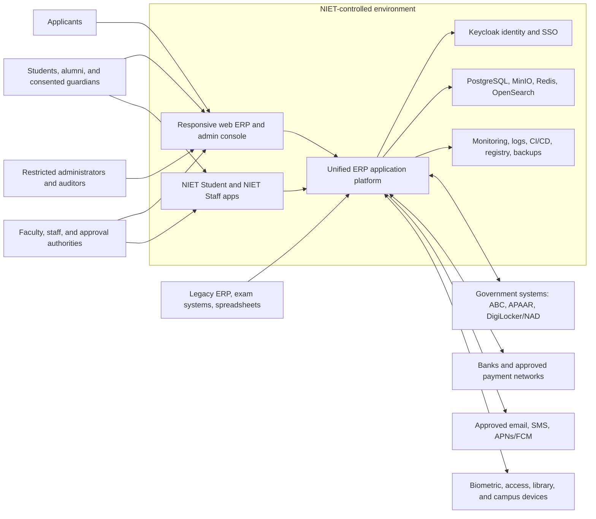
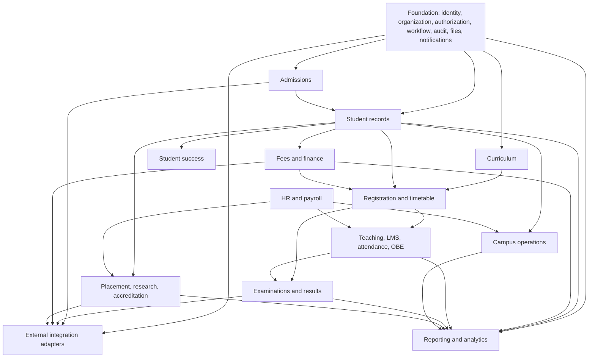
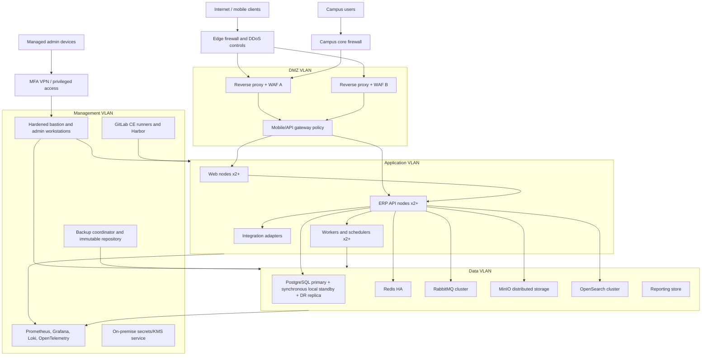

# NIET Unified ERP — Phase 0 Architecture and Implementation Plan

**Institution:** Noida Institute of Engineering and Technology, Greater Noida  
**Document status:** Proposed baseline for institutional review  
**Scope:** Discovery and architecture only; no application implementation is authorized by this document  
**Deployment constraint:** On-premise, institution-controlled infrastructure  
**Decision rule:** Unknown institutional policy is represented as configuration or an explicit decision gate, never as an assumed rule

## 1. Executive summary

NIET Unified ERP will be a single institutional platform spanning the student, academic, examination, finance, workforce, research, accreditation, placement, and campus lifecycles. The recommended starting architecture is a TypeScript monorepo with a modular NestJS/Fastify backend, Next.js web applications, and separate React Native CLI student and staff applications. PostgreSQL remains the transactional system of record; supporting on-premise services provide identity, files, search, messaging, caching, observability, and reporting.

The platform should begin as a modular monolith with enforceable domain boundaries. Identity, file scanning/storage, notification delivery, search indexing, reporting workloads, and external integrations are isolated behind ports and queues, but need not all begin as separately deployed custom services. This avoids a premature microservice estate while preserving later extraction paths.

The first production release must be a controlled vertical slice, not a collection of screens: authenticated users, policy-based authorization, audit evidence, workflow approvals, file handling, notifications, monitoring, backup/restore, and negative authorization tests must work before student domains are added.

### Architecture decisions proposed for approval

| Decision | Proposal | Reason |
|---|---|---|
| Application shape | Modular monolith first | Lowest operational complexity with explicit domain ownership |
| Main language | Strict TypeScript | Required stack consistency and shared contracts/tooling |
| Transactional data | PostgreSQL HA cluster | Strong integrity, transactions, mature backup and replication |
| Identity | Self-hosted Keycloak, federated with NIET directory if available | SSO, MFA, lifecycle, standards support |
| Authorization | Application-owned RBAC + ABAC policy enforcement; Keycloak supplies identity and coarse roles | Department, programme, cohort, record, consent, and purpose constraints exceed realm-role semantics |
| Async messaging | RabbitMQ initially | Durable delivery, routing, dead-lettering, broad operations knowledge |
| Object storage | MinIO with versioning and immutability policies | On-premise S3-compatible document control |
| Search | OpenSearch with authorization-filtered indexes and application re-check | Fast institution-wide search without trusting the index as authority |
| Analytics | Separate reporting PostgreSQL initially; columnar warehouse only after measured need | Prevent analytical load on OLTP without unnecessary infrastructure |
| Deployment | HA virtual machines and containers; no Kubernetes initially | Easier for a typical institutional operations team to own |
| Mobile notifications | APNs/FCM only if approved; opaque event ID only | Native background-delivery reality without leaking content |

## 2. Scope, assumptions, and unresolved questions

### 2.1 Working assumptions requiring confirmation

1. NIET will nominate business owners and data stewards for every domain.
2. The institution can operate two server rooms or a secondary physical recovery site with independent power and networking.
3. A reliable campus identity source exists or can be established for employees and students.
4. Hindi localization is desirable but is not assumed to be a release-one requirement.
5. The existing ERP and departmental systems can provide lawful exports and reconciliation totals.
6. Existing biometric, access-control, library, payment, and messaging vendors expose supported integration interfaces. This must be verified.
7. NIET will approve retention, privacy, consent, and records-disposal schedules before production migration.
8. The initial architecture should support the full institution, but delivery will proceed through bounded, independently accepted capabilities.
9. Internet-facing applicant and mobile APIs will be published through the DMZ; administration will require campus network or managed VPN access.
10. PostgreSQL row-level security may be used as defense in depth for selected sensitive tables, but application authorization remains mandatory.

### 2.2 Decisions required from NIET before Phase 1 exits discovery

| ID | Decision needed | Accountable NIET body | Blocking impact |
|---|---|---|---|
| D-01 | Authoritative identity sources and identifiers for applicants, students, employees, alumni, and guardians | Registrar + HR + IT | Identity model, deduplication, migration |
| D-02 | Institutional role catalogue, scope hierarchy, delegation rules, and segregation-of-duties policy | Registrar + HR + Finance + Exam Cell | Authorization and workflows |
| D-03 | Data classification, retention, archival, legal hold, and deletion policy | Legal/Administration + IQAC + IT Security | Storage, backups, privacy, audit |
| D-04 | Parent/guardian access, student consent, revocation, and exceptional-access policy | Student Affairs + Legal | Guardian portal/app permissions |
| D-05 | Academic regulations by regulation year, grading, progression, credit, repeat, grace, and exit rules | Academic Council + CoE | Curriculum and examination engines |
| D-06 | Admission seat matrices, eligibility, reservation/category handling, merit, refund, and scholarship policy | Admissions + Finance | Admissions workflows |
| D-07 | Fee schedules, accounting chart, tax handling, reversals, refunds, and approval limits | Finance | Finance architecture and controls |
| D-08 | Examination confidentiality model and question-paper custody procedure | Controller of Examinations | Security zones and access controls |
| D-09 | Sensitive wellbeing/medical/counselling access and emergency break-glass policy | Student Welfare + Medical + Legal | Separate security compartment |
| D-10 | Approved APNs/FCM, SMS, email, payment, DigiLocker/NAD, ABC, APAAR integration posture | Management + IT Security | Integration design and procurement |
| D-11 | RPO/RTO confirmation per module and acceptable planned maintenance windows | Management + IT | Capacity and HA procurement |
| D-12 | Language, accessibility accommodations, and supported device/browser baseline | Student Affairs + IT | UX acceptance criteria |
| D-13 | Whether alumni and guardians receive permanent NIET identities | Registrar + Alumni Office | Lifecycle and licensing/capacity |
| D-14 | Data export approval, report certification, and bulk-action authorization model | Data Governance Council | Reporting and DLP controls |
| D-15 | Build-vs-integrate choices for LMS, library, plagiarism, biometric, access control, and payment systems | Steering Committee | Scope, timelines, contracts |

### 2.3 Information and access required

- Current system inventory, owners, contracts, versions, architecture, and vendor contacts.
- Read-only schemas or representative masked exports, data dictionaries, sample reports, and record counts.
- Existing role lists, organization structure, programme catalogue, regulation documents, and approval orders.
- Peak usage, API latency, storage growth, attachment sizes, and seven-day traffic profiles.
- Network diagrams, server inventory, directory services, DNS, PKI, NTP, mail relay, SMS, backup, and security tooling.
- Regulatory reports and evidence packages currently submitted to NAAC, NBA, NIRF, AICTE, UGC, IQAC, and autonomous bodies.
- Existing payment settlement/reconciliation formats and bank/PG integration documents.
- Hardware/vendor protocol documentation for biometric, ID/access, library, transport, and laboratory systems.

## 3. Architectural principles and quality attributes

1. **One accountable record:** Each entity and fact has one owning domain; other domains use APIs/events, not direct table writes.
2. **History over mutation:** Effective-dated versions, append-only ledgers, and explicit correction workflows preserve institutional history.
3. **Deny by default:** Every request is authenticated, authorized against action, resource, scope, purpose, and relevant consent.
4. **Configuration over hard-coding:** Academic, fee, routing, and approval policy is versioned, tested, effective-dated configuration.
5. **Audit as a transaction outcome:** Critical business changes and their audit event commit atomically via an outbox pattern.
6. **No synchronous integration dependency in core commits:** External delivery uses queues, idempotency, retries, and reconciliation.
7. **Graceful degradation:** Search, analytics, outbound notifications, and non-critical integrations may fail without corrupting OLTP work.
8. **Accessible and bandwidth-aware:** WCAG 2.2 AA, compact UI, progressive enhancement, and minimized mobile payloads are acceptance requirements.
9. **Operational simplicity:** Add infrastructure only when NIET staff can patch, monitor, recover, and test it.
10. **Measured performance:** p95 latency, queue age, database contention, mobile startup, and failure recovery are continuously tested.

### Initial service-level objectives

| Capability | Target | Measurement |
|---|---:|---|
| Common API latency | p95 < 500 ms | Server-side excluding approved external providers |
| Standard web interactivity | < 2 seconds on campus LAN | Defined reference workstation and dataset |
| Mobile cold start | < 3 seconds | Defined mid-range Android reference device |
| Search response | p95 < 2 seconds | Permission-aware institutional search |
| Critical ERP availability | Proposed 99.9% monthly | Excluding approved maintenance; confirm D-11 |
| Critical data RPO/RTO | 15 minutes / 4 hours | Proven by restoration/failover exercises |
| Non-critical RTO | 24 hours | Proven by restoration exercise |

## 4. System context



### Trust boundaries

- The public internet is untrusted; only hardened DMZ endpoints are reachable.
- Mobile devices and browsers are untrusted execution environments; local caches contain only necessary encrypted data.
- Keycloak establishes identity, not resource authorization by itself.
- Search indexes, analytics replicas, and event messages are derived data, never the final authority for a protected operation.
- External providers receive the minimum data contract. Push payloads contain an opaque identifier only.
- Administrative access crosses a separate managed-device/VPN boundary and uses privileged accounts with MFA.

## 5. Domain architecture

### 5.1 Platform and business domains

| Domain | Owns | Key events published |
|---|---|---|
| Identity & access | Identity links, access grants, delegations, consent references, access reviews | IdentityLinked, AccessGranted, AccessRevoked, ConsentChanged |
| Organization | Campuses, schools, departments, programmes, positions, reporting lines | OrganizationChanged, PositionChanged |
| Workflow & tasks | Versioned workflow definitions, cases, steps, delegation, SLA, task inbox | WorkflowStarted, TaskAssigned, TaskCompleted, WorkflowCompleted |
| Audit & compliance | Tamper-evident audit records, access evidence, legal holds | AuditSealed, AccessReviewDue |
| Documents | Metadata, classification, retention, versions, malware status, signatures | DocumentAccepted, DocumentRejected, RetentionDue |
| Notifications | In-app inbox, preferences, templates, delivery attempts | NotificationCreated, DeliveryFailed |
| Admissions | Enquiries, applications, eligibility, offers, seat allocation, conversion | ApplicationSubmitted, OfferAccepted, StudentCreationRequested |
| Student records | Person-linked student record, enrolment history, guardians, holds, status | StudentCreated, StudentStatusChanged, HoldChanged |
| Curriculum | Regulations, curricula, courses, requirements, equivalence, degree audit | CurriculumPublished, RequirementEvaluationCompleted |
| Registration & timetable | Terms, sections, registration, waitlists, rooms, timetable | RegistrationConfirmed, SeatReleased, ScheduleChanged |
| Teaching, LMS & attendance | Sessions, plans, materials, assessments, submissions, attendance, OBE | AttendanceFinalized, AssessmentPublished, AttainmentCalculated |
| Examination | Exam cycles, eligibility, secure papers, evaluation, grades, results, credentials | ExamEligibilityDecided, ResultApproved, ResultPublished |
| Student success | Mentoring, alerts, plans, cases, referrals, leave, grievances | RiskAlertRaised, InterventionAssigned, CaseClosed |
| Finance | Fee subledger, receipts, refunds, GL, budgets, vendors, reconciliation | DemandRaised, PaymentPosted, RefundApproved, JournalPosted |
| HR & payroll | Employees, service records, leave, workload, payroll, separation | EmployeeJoined, PayrollReleased, EmployeeSeparated |
| Placement | Employers, opportunities, eligibility, applications, offers, internships | OpportunityPublished, OfferRecorded, InternshipCompleted |
| Research & incubation | Research outputs, grants, ethics, projects, IP, incubation | EthicsDecisionRecorded, GrantAwarded, IPDisclosed |
| Accreditation | Metrics, lineage, evidence, observations, corrective actions | EvidenceLinked, MetricCertified, ActionOverdue |
| Campus operations | Library adapters, hostel, transport, assets, procurement, facilities, IDs | AssetIssued, WorkOrderRaised, GatePassApproved |
| Reporting & analytics | Certified metric definitions, snapshots, report catalogue | SnapshotCompleted, DataQualityIssueRaised |
| Integration | Provider adapters, mappings, exchange jobs, reconciliations | IntegrationSucceeded, IntegrationFailed |

### 5.2 Internal structure of each module

Each domain follows the same dependency direction:

```text
API/consumer adapters -> application use cases -> domain model/policies
                                      |-> declared ports -> infrastructure adapters
```

- Controllers only authenticate context, validate DTOs, invoke use cases, and map results.
- Domain services contain invariant and rule evaluation; they do not import NestJS or persistence clients.
- Repositories expose domain-specific operations. Cross-domain joins are prohibited in write paths.
- Database tables have a single owning module. Cross-module reads use a stable application query/API or approved reporting projection.
- Every externally consumed REST API is under `/api/v1`; breaking changes create a new version.
- Domain events use a versioned envelope containing event ID, type, schema version, aggregate ID, occurred time, correlation ID, causation ID, tenant/institution ID, and classification—never bearer credentials or unnecessary sensitive content.
- The transactional outbox and idempotent consumers provide at-least-once delivery. Consumers must tolerate duplicates.

### 5.3 Shared platform boundaries

Shared code is limited to primitives: identifiers, money, dates/academic periods, pagination, error contracts, authorization context, event envelope, observability, and test utilities. Business entities are not placed in a generic shared library. This prevents the modular monolith from collapsing into a coupled codebase.

### 5.4 Data ownership and consistency

- PostgreSQL begins as one HA cluster with a database per environment and schema-per-domain ownership. Database roles restrict migrations and runtime access by module grouping.
- A use case that changes records within one domain uses a local ACID transaction.
- Cross-domain processes use orchestrated workflows/sagas with explicit compensation and visible intermediate states.
- Finance uses balanced, append-only journal entries; corrections are reversals and repostings.
- Results are never directly edited. A change request captures reason, evidence, before/after values, maker/checker approvals, and publication consequences.
- Academic and identity history is effective-dated. Published regulations are immutable; amendments create a new version.
- Contested aggregates use a `version` column for optimistic concurrency.
- Payment, refund, result publication, payroll release, and external submission endpoints require idempotency keys.

## 6. Module dependency map



Arrows represent stable API/event dependencies, not database write access. Cycles are resolved through workflow orchestration and events. For example, finance emits hold changes; registration consumes the projection but does not query finance tables during every page render.

## 7. Identity, roles, and permission model

### 7.1 Authorization design

Authorization evaluates:

`decision = subject + action + resource + institutional scope + relationship + purpose + consent + record state + time + assurance level`

- **RBAC** grants capability bundles to configurable roles.
- **ABAC** restricts grants by campus, department, programme, cohort, section, employment, student relationship, case assignment, and data classification.
- **Relationship-based checks** cover mentor–student, adviser–student, guardian–student, examiner assignment, case ownership, and approval chains.
- **Step-up assurance** is required for high-impact actions and recorded in the audit context.
- **Segregation of duties** prevents the same identity from initiating and finally approving configured critical operations.
- **Delegation** is bounded by action, scope, effective time, reason, and delegator authority; it never expands the original authority.
- **Break-glass access**, if approved, is time-limited, reason-bound, strongly authenticated, immediately alerted, and reviewed.

Roles, departments, approval levels, and policy bindings are data, not UI constants.

### 7.2 Initial role-capability matrix

Legend: **S** self/own records; **A** assigned scope; **D** department/programme scope; **I** institution scope; **C** consent-controlled; **P** policy/step-up controlled; **—** denied by default.

| Role group | Student/employee records | Academic delivery | Results | Finance | HR/payroll | Sensitive cases | Configuration | Audit |
|---|---|---|---|---|---|---|---|---|
| Applicant | S | — | — | S payments | — | — | — | S activity |
| Student | S | S | S published | S fees | — | S submitted cases | — | S activity |
| Guardian | C | C | C published | C | — | — | — | C activity |
| Faculty | A minimum profile | A sections | A draft marks | — | S | A referral only | — | A activity |
| Mentor/adviser | A | A progress | A published | Hold status only | — | A non-clinical notes | — | A activity |
| HOD/Dean | D | D | D approval P | D budget/report | D workload | D non-clinical oversight | D proposals | D read |
| Registrar | I authorised fields | I records | Published credential operations P | Holds/report | — | — | Registry policy P | I read P |
| Exam cell/CoE | Eligibility minimum | Exam operations | I controlled workflow P | Fee status only | Duty assignment | — | Exam policy P | Exam audit P |
| Finance | Identity minimum | — | — | I P | Payroll finance P | — | Finance policy P | Finance audit P |
| HR/payroll | Employee-related minimum | Workload | — | Payroll posting P | I P | Employee cases A | HR policy P | HR audit P |
| Placement/research/IQAC | Eligible scoped profile | Relevant outcomes | Aggregate/published | Scoped grants/budgets | Scoped profile | — | Own-domain policy | Own-domain audit |
| Campus operators | Minimum ID/status | — | — | Charge status where needed | Minimum profile | — | Own-domain policy | Own-domain audit |
| System administrator | Technical metadata only | — | — | — | — | — | Platform configuration P | Security audit metadata P |
| Security administrator | Account/security metadata | — | — | — | — | — | IAM/security policy P | Security events P |
| Auditor | Approved read-only scope | Read | Read history P | Read P | Read P | Explicitly excluded unless mandated | — | Read/export P |

This is a capability baseline, not the final policy. Named roles, scope inheritance, exceptional access, and segregation rules require D-02 and domain workshops. System administrators must not automatically receive business-record access.

### 7.3 High-risk action controls

Result changes, grade approval, fee reversal, refund approval, payroll release, bank-detail changes, deletion/anonymization, role assignment, audit-log access, bulk export, question-paper access, and production configuration publication require configurable combinations of step-up MFA, maker-checker approval, reason, evidence, optimistic locking, idempotency, immutable audit evidence, and post-action alerting.

## 8. Data architecture and classification

### 8.1 Data classification policy

| Class | Examples | Minimum controls |
|---|---|---|
| Public | Approved public notices, programme catalogue, public policy | Integrity controls, approved publication workflow |
| Internal | Timetables, internal procedures, non-sensitive aggregate operations | Authenticated access, scope controls, standard encryption and retention |
| Confidential | Student records, marks, attendance, employee files, fees, applications, placement records | Need-to-know ABAC, encryption, masked UI/logs, export controls, access logging |
| Restricted | Government IDs, bank data, payroll, question papers, credentials/signatures, disciplinary records | Field encryption, step-up, narrow roles, dual control where applicable, enhanced monitoring |
| Highly restricted/compartmented | Counselling, medical/wellbeing notes, protected complaints, security secrets | Separate permission namespace and keys, assigned-case access, no general administrator access, exceptional break-glass controls |

The data owner assigns classification at the field/document type level. Derived data inherits the highest relevant classification unless an approved de-identification process proves otherwise.

### 8.2 Core data controls

- TLS 1.2+ with TLS 1.3 preferred; NIET-managed PKI for internal service identities.
- Encrypted disks and database/object backups; application-level envelope encryption for restricted fields with keys outside the database.
- MinIO object versioning, retention policies, integrity metadata, malware quarantine, content-sniffing, allowlisted file types, and short-lived signed download URLs.
- Logs use allowlisted structured fields and automatic redaction; tokens, passwords, full IDs, bank data, payment data, and protected case content are forbidden.
- Search indexes store only fields approved for search and carry explicit authorization attributes. The source service re-authorizes record access.
- Non-production environments use synthetic or irreversibly masked data.
- Production support access is time-bound, approved, observed, and audited.
- Retention deletion propagates to derived stores subject to legal hold and immutable backup policy. Backup expiry is documented rather than surgically editing immutable copies.

### 8.3 Reporting architecture

Transactional outbox events and controlled change-data capture feed a separate reporting store. Certified metrics are versioned with owner, definition, source lineage, refresh time, quality status, and approval. Dashboards drill to authorized source records. Heavy reports, cohort analysis, accreditation snapshots, and scheduled exports never run directly on the primary OLTP node.

Initial reporting can use a dedicated PostgreSQL reporting database with partitioned facts and dimensional projections. Evaluate an on-premise columnar engine only after representative workload testing demonstrates the need.

## 9. On-premise network and deployment topology



### 9.1 Network rules

- Default-deny between VLANs; only documented source/destination ports are opened.
- Internet traffic terminates in the DMZ. No database, message broker, object store, search, CI/CD, or monitoring endpoint is internet-accessible.
- Application nodes connect to data services using dedicated identities and least-privilege rules.
- Outbound internet access uses an allowlisted egress proxy. Integration adapters are the only components permitted to call approved external endpoints.
- Management traffic originates from the bastion or configuration-management service. SSH/RDP from general user networks is denied.
- Production, staging, development, backup, and management planes are separated. CI runners cannot freely reach production data.
- Central NTP, DNS, certificate rotation, vulnerability scanning, endpoint protection, and configuration baselines are mandatory.

### 9.2 Deployment recommendation

Use redundant virtual-machine hosts across two local fault domains, with rootless containers or Podman/Docker under declarative configuration management. Kubernetes is deferred until NIET demonstrates 24x7 cluster operations, upgrade, network, storage, security, and disaster-recovery capability. GitLab CE builds signed images; Harbor stores and scans them; promotion uses immutable image digests and environment approvals.

### 9.3 Capacity inputs and hardware procurement

Final sizing cannot be produced without user counts, concurrency, data volume, attachment growth, retention, and workload measurements. Procurement will likely include redundant virtualization hosts, HA firewalls/load balancers, database-class NVMe storage, distributed object-storage nodes, backup appliances/storage, offline/immutable media, DR-site capacity, 10/25 GbE switching, HSM or supported key-management hardware, rack power/UPS/generator capacity, and managed administrative workstations. A capacity model and three-year growth forecast must precede tender specifications.

## 10. Initial threat model

### 10.1 Critical assets and adversaries

Critical assets include identity and MFA data, academic records and credentials, examination papers/results, fee and payroll ledgers, government identifiers, bank details, protected student cases, audit evidence, cryptographic keys, backups, and administrative control planes.

Relevant adversaries include internet attackers, credential thieves, malicious or coerced insiders, over-privileged vendors, compromised student/staff devices, malware/ransomware, fraudulent applicants, colluding approvers, and accidental operators.

### 10.2 Priority threats and controls

| Threat | Exposure | Required design controls | Residual validation |
|---|---|---|---|
| Account takeover | Public login, reused credentials, phishing | MFA/passkeys, rate limits, risk alerts, session/device management, recovery controls | Red-team recovery and session revocation |
| Broken object-level authorization | APIs and search | Central policy API/library, resource-scoped checks, negative tests, index filtering plus source re-check | Per-role automated authorization suite |
| Insider result/finance fraud | Privileged workflows | Maker-checker, SoD, step-up, immutable before/after audit, reconciliation, alerts | Fraud scenarios and audit sampling |
| Question-paper disclosure | Storage, workflow, endpoints | Compartmented storage/keys, time-bound access, dual control, watermarking, no indexing, monitored downloads | CoE procedure and tabletop exercise |
| Sensitive-case disclosure | Mentoring/support tools | Separate permission namespace, assigned-case access, protected notes, break-glass review | Privacy review and access-log audit |
| Malicious upload | Applicant/document intake | Quarantine, AV/CDR where justified, content inspection, size/type limits, isolated processing | EICAR and malformed-file tests |
| Injection/XSS/CSRF/SSRF | Web/API/integrations | Typed validation, parameterization, CSP, output encoding, same-site/CSRF controls, URL allowlists, egress controls | SAST/DAST and targeted penetration test |
| Queue replay/duplicate financial action | Async jobs/provider callbacks | Signed callbacks, idempotency, nonce/timestamp, inbox/outbox, reconciliation | Replay and duplicate-delivery tests |
| Ransomware or destructive admin | Servers and backups | Segmentation, least privilege, EDR, immutable/offline backup, separate backup credentials | Restore exercise from isolated environment |
| Audit tampering | Privileged database access | Append-only permissions, hash chaining/periodic sealing, replicated archive, access alerts | Integrity verification and restore test |
| Data leakage via logs/exports/push | Observability and user actions | Schema allowlists/redaction, export watermarking/approval, DLP, opaque push IDs | Automated log scans and export tests |
| Supply-chain compromise | npm, containers, CI | Lockfiles, private registry proxy, SBOM, signing, dependency/container/secret scanning, protected runners | Build provenance verification |
| Availability attack/peak overload | Admission/results/registration | WAF/rate limits, capacity tests, caching, queueing, read models, degradation modes | Peak-load and node-failure drills |

### 10.3 Security work before production

- Formal data-protection impact review and statutory review.
- Detailed abuse cases for admission fraud, attendance proxying, grade changes, refunds, payroll, procurement, and bulk exports.
- Independent penetration test, mobile application security assessment, and remediation verification.
- Incident response playbooks for identity compromise, data exfiltration, ransomware, payment discrepancy, exam-paper leak, and lost mobile device.
- Security ownership, vulnerability SLAs, patch windows, key rotation, access reviews, and vendor-access policy.

## 11. Backup, continuity, and disaster recovery

### 11.1 Backup design

- PostgreSQL continuous WAL archiving plus scheduled full backups supports 15-minute or better RPO; backups are encrypted and recovery-tested.
- MinIO uses distributed erasure coding, versioning, site replication where available, and independent backup of metadata/configuration.
- Keycloak, OpenSearch, RabbitMQ definitions, secrets metadata, GitLab, Harbor, monitoring configuration, infrastructure code, and encryption-key recovery procedures are included in recovery plans.
- Maintain online local recovery copies, an immutable copy using separate credentials, and an offline copy. Replicate critical copies to a secondary physical site where possible.
- Backup monitoring verifies age, completeness, integrity, capacity, and encryption; a successful job is not reported as recoverable until restore tests pass.

### 11.2 Recovery validation

- Monthly automated sample restores into an isolated environment.
- Quarterly end-to-end restoration exercise for PostgreSQL plus referenced documents.
- Semiannual site-failure exercise and annual business continuity simulation.
- Record actual recovery point, recovery time, data reconciliation, application integrity, credential rotation, and lessons learned.
- Recovery runbooks identify roles, contact paths, dependencies, invocation authority, communication templates, and fallback manual procedures.

## 12. Migration strategy

### 12.1 Migration stages

1. **Inventory:** Catalogue every source, owner, legal basis, data period, quality, format, interface, volume, and dependency.
2. **Profile:** Measure nulls, duplicates, invalid identifiers, orphan relationships, contradictory facts, encoding, and historical gaps using read-only copies.
3. **Canonical mapping:** Define source-to-target mapping, transformation, reference-data mapping, ownership, and unambiguous precedence. Obtain steward sign-off.
4. **Cleansing and identity resolution:** Produce review queues for duplicates and conflicts. Never automatically merge high-risk identities solely on fuzzy similarity.
5. **Rehearsal pipeline:** Extract to a quarantined landing zone, validate checksums, transform with version-controlled jobs, load into an isolated target, and generate reconciliation evidence.
6. **Trial migrations:** Run multiple full-volume rehearsals, domain UAT, performance tests, security review, and restore tests.
7. **Dual run:** Operate a time-bounded parallel period with defined authoritative-write rules and daily reconciliation; avoid open-ended dual entry.
8. **Cutover:** Freeze relevant legacy writes, take final delta, reconcile counts and financial/academic control totals, obtain business sign-off, switch integrations, and monitor.
9. **Rollback:** Define objective triggers, maximum decision time, reverse-interface handling, and data captured after cutover. Rehearse it.
10. **Legacy archive:** Preserve a read-only, access-controlled, searchable archive with retention, audit, and independent backups; decommission only after formal acceptance.

### 12.2 Required reconciliation

Reconcile record counts and hash/control totals by cohort and status; fee demands, receipts, refunds, and GL balances; registered credits; attendance aggregates; published results and grade distributions; employee/payroll totals; document references and checksums; unresolved workflows; and identity/account links. Exceptions require an owner, disposition, evidence, and approval.

### 12.3 Migration safety rules

- Migration jobs are repeatable and idempotent and use immutable source snapshots.
- Imported records carry provenance: source system, source key, extraction time, mapping version, and batch.
- Invalid or unverified records remain quarantined; they are not silently defaulted into production.
- Production credentials and real restricted data are unavailable to developer workstations.

## 13. Delivery plan and acceptance gates

### Phase 0 — Discovery and architecture

**Outputs:** approved decisions, domain boundaries, information architecture, policy backlog, threat model, data classification, source inventory, capacity baseline, deployment design, migration approach, programme governance, and procurement inputs.

**Exit gate:** Steering Committee approves the architecture decision record; D-01 through D-04 and D-11 have owners and dates; initial domains have named product owners/data stewards; representative data and network constraints are verified; Phase 1 funding and operations staffing are committed.

### Phase 1 — Platform foundation

Build the monorepo, CI quality gates, identity integration, authorization policy enforcement, organization model, audit, workflow/tasks, notification centre, documents, search foundation, design system, API standards, observability, secrets, deployment automation, and proven backup/restore.

**Recommended vertical slice:** A staff member signs in with MFA, receives a scoped role, submits an audited document-backed request, an authorized approver acts with delegation/step-up rules, the user sees an in-app notification, a permitted user can find the case, a forbidden user cannot, and the system is restored from backup.

**Exit gate:** Threat-model controls have automated tests; negative authorization tests exist for every platform role; restore and node-failure tests meet targets; admin console is network-restricted; operational runbooks are accepted.

### Phase 2 — Student core

Deliver admissions, canonical student records, curriculum/regulation versioning, degree-audit foundation, registration, timetable, attendance, fee subledger/payment integration, student web/mobile minimum viable journeys, and migration wave one.

**Exit gate:** End-to-end admission-to-student conversion and registration/fee/attendance workflows reconcile against approved rules and migrated control totals.

### Phase 3 — Academic delivery

Deliver LMS essentials, assessment, OBE/CO–PO, mentoring, explainable risk alerts, interventions, referrals, and protected-case partitioning.

**Exit gate:** Course delivery and student-success cases have complete authorization, privacy, audit, notification, and outcome reporting.

### Phase 4 — Autonomous examinations

Deliver eligibility, enrollment, scheduling, secure question-paper workflow, anonymization, evaluation, moderation, approval, publication, challenges, transcripts, and verified credentials.

**Exit gate:** A full mock examination cycle passes segregation, confidentiality, result-change, reconciliation, load, and recovery tests and receives CoE sign-off.

### Phase 5 — Workforce and finance

Deliver HR/service book, workload, leave, payroll, general ledger, budgets, vendors, procurement, assets, maintenance, tax/reconciliation, and separation/access revocation.

**Exit gate:** Parallel payroll and finance closes reconcile; maker-checker and SoD controls pass internal audit.

### Phase 6 — Outcomes and compliance

Deliver placements/internships, research/grants/incubation, accreditation workspaces, certified metrics, data lineage, and management analytics.

**Exit gate:** Selected statutory/accreditation returns reproduce approved historical submissions with traceable source evidence.

### Phase 7 — Campus operations and optimization

Deliver hostel, mess, transport, library adapters, digital ID/access control, facilities/helpdesk, events and advanced analytics; optimize from measured production behavior.

**Exit gate:** Campus integrations pass fail-safe and reconciliation tests; capacity, accessibility, recovery, and operations objectives are sustained.

### Cross-phase delivery rules

- Use short domain increments with demonstrations to business owners, but release only through the phase gate.
- Every module includes the 20 specified deliverables: problem, roles, stories, rules, workflow, model, API, permissions, audit, screens, validation, notifications, reports, integrations, failures, risks, tests, deployment, and acceptance.
- Definition of done includes security, authorization, audit, observability, backup/restore impact, documentation, support readiness, and data migration—not UI completion.
- Architecture decisions are recorded as versioned ADRs. Policy changes are effective-dated configuration changes with impact testing.

## 14. What can start and what is blocked

| Category | Items |
|---|---|
| Can start immediately | Stakeholder workshops; system/data inventory; UX research; accessibility baseline; threat workshops; network/capacity measurement; monorepo and API conventions design; domain-event conventions; synthetic-data test strategy; procurement requirements discovery |
| Requires NIET policy | Roles and SoD; guardian consent; academic/grading rules; admission/seat/refund rules; fee/accounting policy; retention/deletion; protected-case access; delegation; report certification/export; language/support policy |
| Requires existing data access | Canonical identifiers; migration estimates; deduplication; longitudinal history; reconciliation; report lineage; capacity/storage sizing; search taxonomy |
| Requires hardware/procurement | HA compute/storage/network; backup and immutable/offline media; DR site; WAF/firewalls; HSM/KMS option; managed admin endpoints; biometric/access/library compatibility |
| Requires external integration | Banks/payment gateway; SMS/email; APNs/FCM decision; DigiLocker/NAD; ABC; APAAR; ORCID; plagiarism; vendor hardware and government endpoints |
| High operational/security risk | Premature Kubernetes/microservices; unsupported vendor devices; weak identity matching; direct result/ledger edits; overly broad admin roles; sensitive data in logs/push/search; untested backup; open-ended dual run; production data in test; question-paper exposure |

## 15. Product and experience architecture

### 15.1 Surfaces

- **ERP web:** role-aware operational workspace for students and staff.
- **Restricted admin console:** configuration, identity linkage, policy publication, audit access, and high-risk operations; reachable only from managed networks/VPN.
- **NIET Student:** task-first native app with today/next/deadlines/holds, encrypted offline schedule and ID, low-bandwidth mode, and accessible flows.
- **NIET Staff:** schedule/roster/attendance/assessment/mentoring/approvals; bulk result, payroll, role, and financial closing remain web-only.

### 15.2 Design system direction

Use the official unmodified NIET logo after asset and usage rights are supplied. Begin with the provisional red `#E5323A`, charcoal, white, and grey palette; confirm the production primary token from the official vector. Red is reserved for action and brand accents rather than dominant surfaces. Components are compact, keyboard-operable, screen-reader tested, touch-target compliant, and usable at 200% zoom. Tables support accessible captions, responsive priority columns, saved filters, column configuration, and permission-controlled export.

Every journey specifies loading, empty, validation, authorization, conflict, offline, retry, partial-failure, and completed states. Destructive or high-impact bulk actions show scope and consequences and require confirmation; undo is offered only when domain-safe.

## 16. API, reliability, and testing baseline

### 16.1 API conventions

- REST JSON under `/api/v1`, generated OpenAPI, explicit DTO schemas, bounded pagination, stable error codes, correlation IDs, and UTC ISO timestamps with institutional timezone shown at presentation.
- OAuth 2.1/OIDC authorization code with PKCE for browser/mobile clients; secure HTTP-only same-site cookies for web BFF sessions where applicable; tokens never enter logs or insecure storage.
- Optimistic concurrency through version/ETag, idempotency for high-impact commands, signed and replay-protected provider callbacks, and per-client/action rate limits.
- WebSocket channels authorize both connection and subscription; revocation terminates affected sessions. WebSockets carry invalidation/event IDs, not unrestricted record payloads.

### 16.2 Test pyramid and release gates

- Domain unit tests for rules, boundary values, effective dates, and invariants.
- PostgreSQL-backed integration tests for repositories, transactions, migrations, outbox, locking, and constraints.
- API contract and consumer tests for web, mobile, integrations, and events.
- Permission tests generated from the approved matrix, emphasizing negative cases and scope crossings.
- End-to-end tests for critical workflows plus accessibility automation and manual assistive-technology checks.
- Mobile tests for secure storage, offline behavior, device loss/logout, deep links, low bandwidth, and upgrade migrations.
- Performance tests using production-scale synthetic datasets and burst profiles for admissions, attendance, registration, fees, and results.
- Security tests: SAST, dependency/secret/container/IaC scans, DAST, file-upload tests, session tests, and independent penetration testing.
- Migration and backup restoration tests are release gates, not operational afterthoughts.

No deployment proceeds with unresolved critical/high security findings, failed negative-authorization tests, unproven rollback, or untested schema migration.

## 17. Programme governance and team model

Establish an ERP Steering Committee, Architecture Review Board, Data Governance Council, Security and Privacy working group, and domain product councils. Each domain needs an empowered NIET product owner, data steward, process owner, and acceptance group.

Suggested delivery capabilities include product/process analysis, architecture, UX/accessibility, TypeScript backend, web, React Native, data/migration, QA automation, platform/SRE, security, and training/change management. Separate production duties: developers do not hold standing production database access; release approval and deployment are auditable; business administrators cannot alter platform security policy without review.

Key programme measures include workflow completion and exception rates, data-quality defects, authorization denials/anomalies, p95 latency, availability, queue age, restore success and measured RTO/RPO, accessibility defects, support volume, adoption, reconciliation differences, and policy-decision aging.

## 18. Phase 0 review checklist and approval record

Before authorizing Phase 1, NIET should confirm:

- [ ] Scope, principles, modular-monolith approach, and system boundaries.
- [ ] Named business owner and data steward for every phase-one domain.
- [ ] Identity sources, canonical identifiers, role governance, and consent direction.
- [ ] Data classification, retention, legal hold, and protected-case posture.
- [ ] Network zones, internet exposure, admin access, egress, and operations ownership.
- [ ] RPO/RTO, availability targets, secondary-site strategy, and restoration calendar.
- [ ] Source-system access, migration authority, initial wave, and reconciliation owners.
- [ ] Mobile push and external-provider approval boundaries.
- [ ] Procurement discovery and capacity-measurement plan.
- [ ] Security testing, incident response, and independent assurance budget.
- [ ] Phase 1 vertical slice and objective exit criteria.

### Approval placeholders

| Authority | Name | Decision | Date | Conditions |
|---|---|---|---|---|
| Executive sponsor | TBD | Pending | — | — |
| Registrar | TBD | Pending | — | — |
| Controller of Examinations | TBD | Pending | — | — |
| Finance owner | TBD | Pending | — | — |
| HR owner | TBD | Pending | — | — |
| IT infrastructure owner | TBD | Pending | — | — |
| Information security owner | TBD | Pending | — | — |
| Data governance owner | TBD | Pending | — | — |

## 19. Risks and limitations of this baseline

This document is an architecture hypothesis based on the supplied brief, not a substitute for discovery evidence. It deliberately does not define grading, fees, reservations, statutory interpretation, approval limits, retention periods, or organizational roles. Hardware counts and timelines remain provisional until actual volumes, peak concurrency, current network capacity, data quality, vendor interfaces, and operations staffing are measured. Government and financial integrations require current specifications, contracts, security review, sandbox access, and formal approval.

The largest programme risk is attempting broad module construction before identity, ownership, policy, migration quality, and operations are settled. The correct next step is institutional review of this Phase 0 baseline followed by structured discovery workshops and evidence collection—not application scaffolding.
